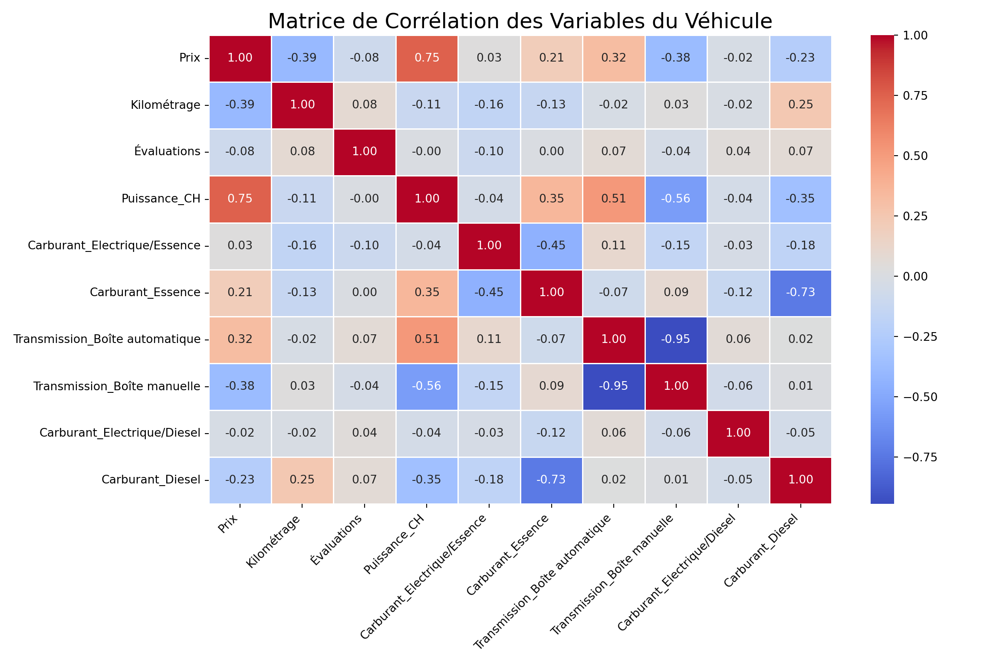
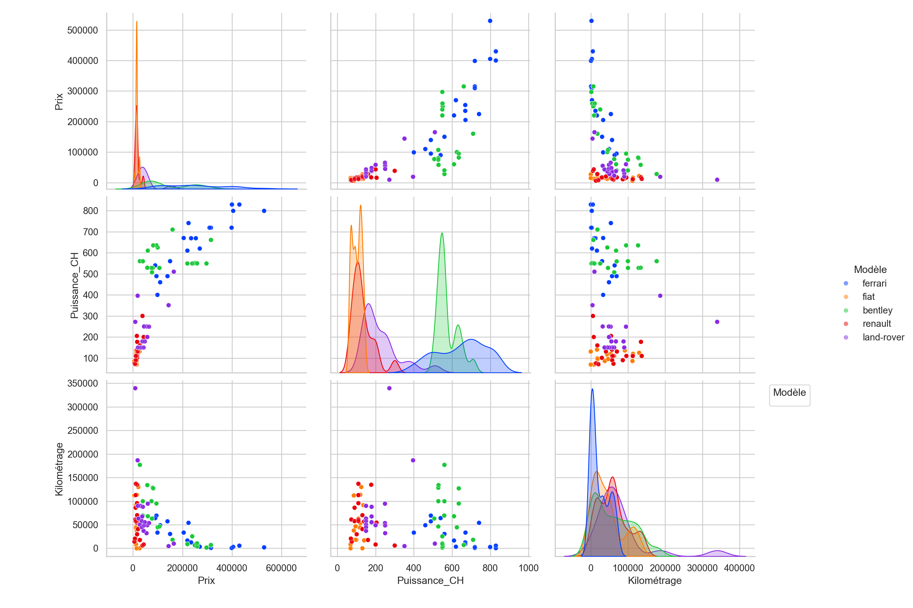
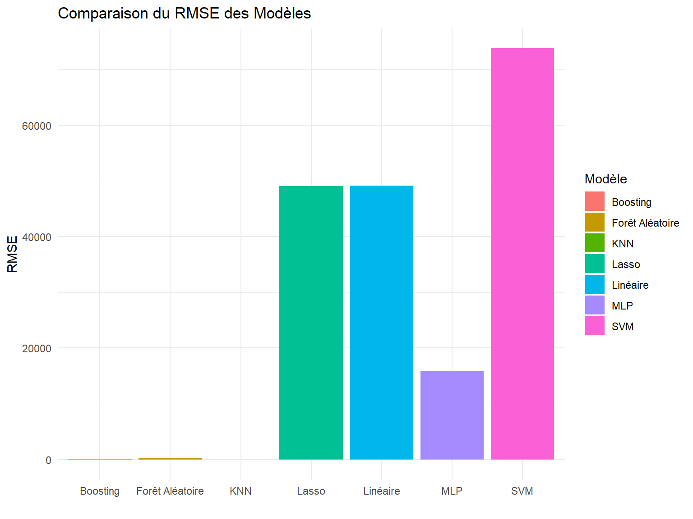
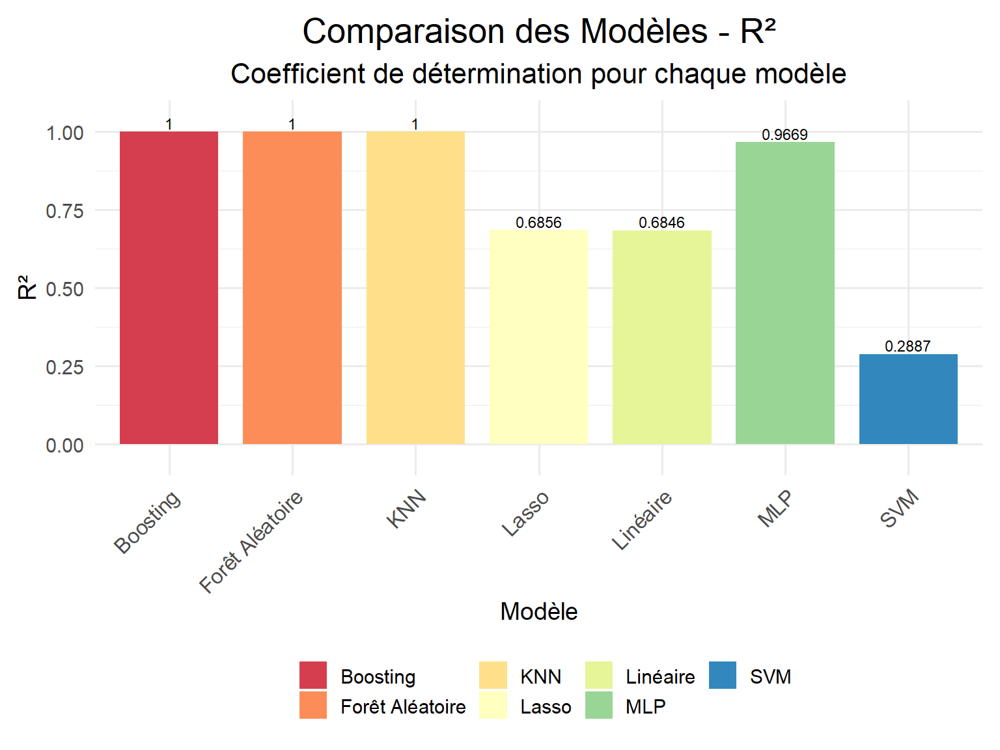

<<<<<<< HEAD
# Predicting Car Prices Using Machine Learning

# Contents

* [Introduction](#Introduction)
* [Scraping](#Scraping)
* [Data](#Data)
* [Statistiques](#Statistiques)
* [MachingLearning](#MachingLearning)

# Introduction

This project focuses on predicting the prices of luxury and standard vehicles listed on AutoScout24, using machine learning models. The objective is to develop an efficient and reliable predictive model capable of estimating car prices with high accuracy, there by providing valuable insights for buyers, sellers, and enthusiasts in the automotive industry.

The core concept is to determine a vehicle's value based on its characteristics, using a trained model that analyzes various brands and model competitors. This predicted price will then be compared with the actual price listed on AutoScout24. If the ratio is positive, it indicates that the model's predicted price is higher than the actual price on AutoScout24. In such cases, we can infer that the car is priced low given its characteristics."

This revised version provides a clearer understanding of the project's aim, methodology, and the criteria for evaluating the success of your predictive model.

 

# Scraping

The `VehicleScraper.py` script is designed to extract detailed information about various vehicle models from [AutoScout24](https://www.autoscout24.be/fr/). It focuses on
 retrieving key data suchas the **brand**, **power**,**evaluation**,**name**,**version**, **mileage**, **fuel**,**type**,**transmission type**, **seller** . Users can µ
 select specific vehicle makes and models for data extraction.

To initiate the scraping process, the application is launched using the command python `main.py`. The main.py script serves as the entry point for 
executing the VehicleScraper, orchestrating the data scraping and handling the user's choices for marque and model selection."

## Data 

**Data Before Cleaning**

| Modèle | Prix | Transmission | Version | Kilométrage | Carburant | Puissance | Évaluations | Vendeur | Nom de la Voiture | Date |
|--------|------|--------------|---------|-------------|-----------|-----------|-------------|---------|-------------------|------|
| Audi   | €74 999 | Boîte automatique | 55 TFSI Quattro Tiptronic S-Line INDIVIDUAL! | 34 000 km | Essence | 250 kW (340 CH) |  122  | Kristof D'herde • BE-9300 Aalst|Audi Q855 TFSI Quattro Tiptronic S-Line INDIVI  | 01/2021 |
| Mercedes-benz | € 82 900|Boîte automatique|4.0 V8 BiTurbo Camera Memory glazen dak 213|21 300 km |Essence | 340 kW (462 CH)|235|Placido Palermo • BE-5190 Jemeppe-sur-Sambre| 	Mercedes-Benz AMG GT4.0 V8 BiTurb|10/2016|
|Fiat| € 13 800 |Boîte automatique|NAVIGATIE*DIGITALE-AIRCO*CRUISE-CONTROLE*LED|46 546 km  |Essence |70 kW (95 CH)|179 |Philip Uyttendaele • BE-9340 Lede|Fiat TipoNAVIGATIE*DIGITALE-AIRCO*CRUISE-CONTR...|10/2016|
|toyota|€ 19 490|Boîte automatique|X envy|4 642 km|Essence |53 kW (72 CH)|2|Huseyin Mazibas • BE-1070 Anderlecht|Toyota Aygo XX envy|12/201_|

We encountered missing values in the fields of **power**, **transmission**, and **evaluation**, which we opted to drop from our dataset. For the **power** attribute, we decided to only keep the measurement in horsepower (HP) and to remove the fields 'Name of the Vehicle', 'Version', and 'Seller'. Additionally, we transformed the 'Model', 'Fuel Type', and 'Transmission' into dummy variables to facilitate our analysis.

 **Types of Variables:**

- **Price**, **Power**, **Evaluation**, **Mileage**: Float
- **Brand**, **Model**, **Transmission**: Categorical

## Statistiques 

**Matrice de Correlation**

-Correlation Between **Price** and **Power** - **Power** and **Boite Automatique**.

-Negative Correlation Between **Boite Automatique** and **Boite Manuelle** - **Boite Manuelle** and **Power** - **Essence** and **Diesel** 

**Comparative analysis of Variables**

## Maching Learning 

**Training and model evaluation**

## Script Overview: `training.py`

The `training.py` script is a key component of our machine learning pipeline and gridsearch best parametre . It interacts closely with `data.py` to perform several crucial tasks:

1. **Data Cleaning and Preparation**: Initially, `training.py` relies on `data.py` to clean and prepare the dataset. This step involves handling missing values, feature engineering, and data normalization or transformation to make it suitable for model training.

2. **Model Training**: Once the data is prepared, `training.py` proceeds to train different machine learning models. It explores a variety of algorithms to identify the model that performs best on our dataset.

3. **Model Saving**: After training, the models are saved for future use. This is done using the `joblib` library, which efficiently serializes Python objects. Each model is saved in the format 'ModelName.joblib', where 'ModelName' represents the specific algorithm or version of the model.

## Script Overview: `evaluation.py`

The `evaluation.py` script plays a crucial role in our machine learning pipeline by evaluating the performance of various models. Here's how it functions:

1. **Loading Models**: The script begins by loading the pre-trained models, saved as 'ModelName.joblib'. This step involves importing each model that was previously serialized using the `joblib` library.

2. **Model Evaluation**: Once the models are loaded, `evaluation.py` systematically tests each one. It does this by applying the models to a designated test dataset and computing key performance metrics.

3. **Performance Metrics**: For every model, the script calculates two critical metrics: 
   - **R-squared (R²)**: This metric indicates the proportion of the variance in the dependent variable that is predictable from the independent variables.
   - **Root Mean Square Error (RMSE)**: RMSE measures the average magnitude of the errors between predicted values and actual values.

By the end of this process, we have a comprehensive understanding of each model's performance, guided by R² and RMSE, enabling us to make informed decisions about which models are best suited for deployment.

## Tableau des Modèles

| Modèle          | RMSE        | R2       |Best Parametre|
|-----------------|-------------|----------|--------------|
| Linéaire        | 49113.33036 | 0.6846197|               |
| Forêt Aléatoire | 301.18096   | 0.9999881|max_depth: 30, min_samples_split: 2, n_estimators: 200|
| Boosting        | 67.38589    | 0.9999994|_learning_rate: 0.2, max_depth: 5, min_samples_split: 2 ,n_estimators: 200|
| **KNN**         | **13.91941**| **1.0000000**|n_neighbors': 25 ,weights: distance|
| MLP             | 15910.26324 | 0.9669029|mlp__alpha: 0.01 , mlp__hidden_layer_sizes: (50, 50, 50)|
| Lasso           | 49034.38591 | 0.6856328| lasso__alpha: 10              |
| SVM             | 73757.81567 | 0.2887015|svm: 10 , svm__gamma: scal,  svm__kernel: linear|

**KNN est le meilleur modèle.**

**RMSE Models**

## R² Values of Models

=======
# Predicting_Price_Cars
>>>>>>> e7505c8490760245c5e029a57d401d881d690123
